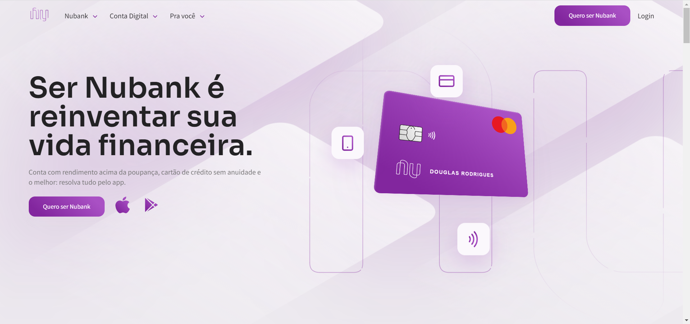

<h1 align="center">
    
     
</h1>
<h1 align="center">
    Nubank
</h1>

## 💻 Sobre o projeto

Projeto desenvolvido durante o curso FrontPush

## 🛠 Tecnologias/Ferramentas

As seguintes tecnologias/ferramentas foram usadas na construção do projeto:

- HTML
- CSS/Sass
- Javascript
- SVGInject
- AOS (Animate On Scroll Library)
- Figma

## 🚀 Projeto

<h4 align="center">
  
</h4>
<h4 align="center">
  Você pode conferir o projeto aqui: <a href="https://douglas-rodr-nubank.netlify.app/" target="_blank">Demo</a>
</h4>

## 🦸 Autor

Desenvolvido por Douglas Rodrigues 👋🏽 [Entre em contato!](https://www.linkedin.com/in/douglas-rodrigues-pnz/)

